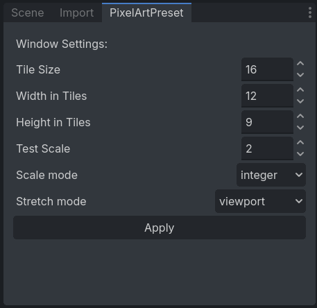

# Pixel Art Preset

A Godot plugin that configures project settings for pixel art games when enabled.

It adds a custom dock where you can set:
- Tile size
- Window width and height (in tiles)
- Test scale for calculating the window override size



#### ❗ Important
Don't forget to press the **Apply button** to apply changes!

## Install Instructions
Alternatively:
- Install via Godot AssetLib 
- Download & unzip to `addons/`  
- Add as a git submodule:
```bash
git submodule add https://github.com/mrkdji/pixel_art_preset addons/pixel_art_preset
```